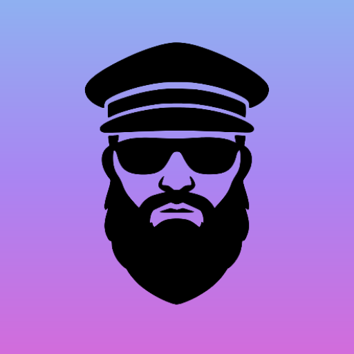

<p align="center">
  
</p>

# Dictator

Dictator turns speech into text on Android and macOS. Transcription runs on the device with whisper.cpp. Audio and transcripts are not sent to a speech service.

This is a sideloaded personal project. It is not published in the Play Store or Mac App Store.

## What it does

### Android

Focus a text field and Dictator shows a movable microphone bubble. Tap it, speak, then tap again. Dictator inserts the transcript at the cursor while your normal keyboard stays open.

The bubble shows recording activity and can display a partial transcript. You can insert at the cursor or replace the field. Before insertion, Dictator checks that the original field still has focus. If an app rejects direct insertion, Dictator can fall back to the clipboard.

Android supports English-only and multilingual FUTO ACFT Whisper models in tiny, base, and small sizes. A multilingual model can listen for up to four selected languages.

### macOS

Dictator runs in the menu bar. Hold Fn to record and release it to transcribe and insert. Double-press Fn to keep recording, then press Fn again to stop. A short Fn tap cancels, as does Escape during recording or transcription.

The macOS app supports FUTO ACFT models and the official Whisper `medium-q8_0` and `large-v3-turbo-q8_0` models. whisper.cpp uses Metal on Apple Silicon.

## Requirements

| Platform | Requirements |
| --- | --- |
| Android | Android 14 or newer, ARM64 (`arm64-v8a`). Tested on a Samsung Galaxy S23. |
| macOS | macOS 14 or newer. Apple Silicon is the current development target. |

Models need between tens and hundreds of megabytes of storage. The larger macOS models need about 800 MB.

## Install on Android

You need the Android SDK, ADB, and a connected device with USB or wireless debugging enabled.

Build and install the release APK from the repository root:

```sh
export ANDROID_HOME="$HOME/Library/Android/sdk"
./gradlew :app:assembleRelease
adb install -r android/app/build/outputs/apk/release/app-release.apk
```

For a debug build:

```sh
./gradlew :app:assembleDebug
adb install -r android/app/build/outputs/apk/debug/app-debug.apk
```

The current release configuration uses your local Android debug keystore. It is suitable for sideloading, but not for store distribution.

### Set up Android

1. Open Dictator.
2. Choose and download a speech model.
3. Grant microphone access.
4. Open Android Accessibility settings and enable **Dictator dictation bubble**.
5. Focus a text field in another app.
6. Tap the bubble to record. Tap it again to transcribe and insert.

Dictator uses Android Accessibility to find the focused field and insert text. It does not replace your keyboard. Models live in app-private storage and work offline after download.

## Install on macOS

You need Xcode Command Line Tools and CMake.

Build and install from the repository root:

```sh
chmod +x native/build-macos.sh macos/build.sh
macos/build.sh
open /Applications/Dictator.app
```

The script builds whisper.cpp with Metal, builds the Swift app, signs it locally, and copies it to `/Applications/Dictator.app`.

Always open `/Applications/Dictator.app`. Do not run `.build/release/Dictator` or `swift run`. macOS ties permissions to the installed app bundle.

### Set up macOS

1. Open `/Applications/Dictator.app`.
2. Grant microphone access.
3. Grant Accessibility access to `/Applications/Dictator.app`.
4. Grant Input Monitoring if macOS requests it.
5. In Keyboard settings, turn off Apple's Dictation and set Globe/Fn to **Do Nothing** if they conflict with Dictator.
6. Download and load a model in Dictator settings.
7. Hold Fn and speak. Release Fn to transcribe and insert.

If Accessibility appears enabled but Dictator cannot use it, remove stale Dictator entries from System Settings and grant access to `/Applications/Dictator.app` again. See [macos/README.md](macos/README.md) for permission troubleshooting.

## Privacy

Dictator records audio only while a dictation session is active. Speech recognition runs locally. The app does not keep a transcript history or intentionally save recordings.

Dictator connects to the network when it downloads a model. It has no accounts, analytics, cloud transcription, or synchronization.

The requested permissions are powerful:

- Microphone access records speech for transcription.
- Android Accessibility finds editable fields and inserts text.
- macOS Accessibility finds the focused app and inserts text.
- macOS Input Monitoring lets Dictator observe Fn or Globe key gestures when required.

Only grant these permissions to a build you trust.

## Limits

- Android requires Android 14 or newer and an ARM64 processor.
- Some apps hide their editable fields from accessibility or reject inserted text.
- Recognition speed and accuracy depend on the device and model.
- Model downloads can use substantial storage.
- The project does not include store packaging, automatic updates, or production signing.

## Test

Run the Android unit tests and lint checks:

```sh
./gradlew :app:testDebugUnitTest :app:lintDebug
```

Run Android instrumentation tests on a connected device:

```sh
scripts/run-adb-tests.sh
```

Run the macOS tests:

```sh
swift test --package-path macos
```

The automated tests do not measure speech accuracy. Accessibility, permissions, and insertion behavior still need testing on real devices.

## Repository layout

```text
android/app/  Android app and tests
macos/     macOS app and Swift tests
native/    whisper.cpp integration and build scripts
docs/      specifications, decisions, and task notes
```

More documentation:

- [Documentation index](docs/README.md)
- [Android specification](docs/specifications/00-local-android-dictation-assistant.md)
- [macOS notes and troubleshooting](macos/README.md)
- [Third-party notices](android/app/src/main/res/raw/third_party_licenses.txt)

## License

Dictator's original source code is available under the [GNU General Public License version 3 only](LICENSE), identified by SPDX as `GPL-3.0-only`. You may use it commercially, modify it, and redistribute it under the terms of that license. If you distribute a modified version, you must license it under GPLv3 and provide the corresponding source to its recipients.

Third-party libraries and speech-model weights keep their own licenses. Check those terms before redistribution or commercial use.

GPLv3 does not require changes to be submitted to this repository, but pull requests are welcome.
